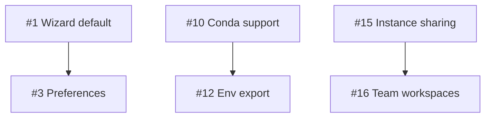

# AWS IDE Project Alignment Strategy

> **Purpose**: This document outlines the comprehensive strategy to align aws-ide's design, documentation, GitHub Issues, and Project board following the organizational methodology from lfr-tools.

**Last Updated**: 2025-10-20
**Status**: Planning Phase

---

## Executive Summary

AWS IDE currently has:
- ✅ Comprehensive ROADMAP.md with phased development plan (v0.7.0 - v1.0.0)
- ✅ Well-structured monorepo with pkg/ and apps/ architecture
- ✅ Basic GitHub infrastructure (issue templates, labels, PR template, workflows)
- ✅ Initial MkDocs documentation structure
- ⚠️ **Missing**: Persona-centric organization and traceability

**Goal**: Transform aws-ide to use the proven lfr-tools organizational methodology:
- **Personas as North Star** - Every feature traces to a user persona
- **Explicit Traceability** - Docs ↔ Issues ↔ PRs all linked
- **Phase-Based Labels** - Enable filtering by roadmap phase
- **Scenario-Driven Docs** - Real researcher walkthroughs
- **Queryable Metadata** - Labels as a query language

---

## Current State Analysis

### ✅ What We Have

**Documentation (3 files)**:
- `docs/index.md` - Landing page with feature overview
- `docs/getting-started/installation.md` - Installation guide
- `docs/user-guides/jupyter.md` - Jupyter user guide
- `README.md` - Technical overview (6 13 lines)
- `ROADMAP.md` - Comprehensive roadmap with v0.7.0-v1.0.0 phases (783 lines)

**GitHub Infrastructure**:
- Issue Templates: 5 templates (bug_report, feature_request, technical_debt, documentation, config)
- Labels: 147 labels across 11 categories (comprehensive!)
- PR Template: Basic template with checklist
- Workflows: 7 active (CI, docs, labels, project-automation, release, e2e-tests, smoke-tests)
- Project: #6 "AWS IDE Development" (empty, no issues)

**Current Personas (from docs)**:
- Solo Researchers
- Research Labs
- Data Scientists
- Graduate Students
- Course Instructors

**Current Phases (from ROADMAP)**:
- v0.7.0: User Experience & Accessibility (in progress)
- v0.8.0: Additional Research Tools
- v0.9.0: Package Managers & Reproducible Environments
- v0.10.0: Collaboration Features
- v0.11.0: Cost Management for Labs
- v1.0.0: Production Ready for Academia

### ⚠️ What's Missing

**Documentation Gaps**:
- ❌ No persona walkthroughs (LFR-Tools pattern: 6 walkthroughs × 1,000 lines each)
- ❌ No USER_REQUIREMENTS.md with success metrics
- ❌ No DESIGN_PRINCIPLES.md with architectural decisions
- ❌ No USER_SCENARIOS/ directory
- ❌ No explicit pain points → GitHub issue mapping
- ❌ Most mkdocs.yml nav pages don't exist yet (19 pages referenced, only 3 exist)

**GitHub Infrastructure Gaps**:
- ❌ Issue templates don't include "Persona" or "Phase" fields
- ❌ Labels exist but missing `phase: 0.7-ux`, `phase: 0.8-tools`, etc.
- ❌ PR template doesn't require "Persona Impact Assessment"
- ❌ No GitHub issues created yet (0 issues total)
- ❌ Project board is empty with no custom fields configured
- ❌ No cross-referencing between docs and issues

**Traceability Gaps**:
- ❌ ROADMAP features don't reference GitHub issues
- ❌ No way to filter issues by persona or phase
- ❌ No explicit "pain point → success metric → issue" flow
- ❌ No GITHUB_ISSUES_SUMMARY.md mapping issues to priorities/personas/phases

---

## LFR-Tools Organizational Methodology

### Core Pattern: 5-Layer Traceability Architecture

```
Personas → USER_SCENARIOS → Design Docs → GitHub Issues → Project Board → PRs
    ↓           ↓                ↓              ↓              ↓           ↓
[6 roles]  [Walkthroughs]  [Requirements]  [Labels]    [Custom Fields]  [Impact]
```

### Key Organizational Principles

1. **Personas are North Star**
   - Every issue MUST answer: "Which persona does this serve?"
   - Issue templates enforce persona selection
   - PR templates require persona impact assessment
   - Project board has "By Persona" view

2. **Pain Point → Success Metric → Issue**
   - Every walkthrough documents quantified pain points
   - USER_REQUIREMENTS.md defines success metrics
   - GitHub issues explicitly reference pain points
   - Example: "Pain: 8 hours → 15 minutes (97% reduction)" maps to Issue #12

3. **Explicit Traceability**
   - Docs reference issues: "Related GitHub Issue: #12"
   - Issues reference docs: "Pain documented in USER_SCENARIOS/01_PROFESSOR.md"
   - PRs reference both: "Closes #12" + "Related docs: USER_SCENARIOS/01_PROFESSOR.md"

4. **Phase-Based Roadmapping**
   - Labels: `phase: 1-enhanced-core`, `phase: 2-advanced-mgmt`, `phase: 3-enterprise`
   - Issues grouped by phase for roadmap planning
   - Project board "Roadmap" view groups by phase
   - Query: `gh issue list --label "phase: 1-enhanced-core,priority: high"`

5. **Labels as Query Language**
   - Multi-dimensional filtering: persona × phase × priority × area × status
   - Enables views like: "Show me all high-priority TA issues in Phase 1"
   - Metadata enables filtering vs duplicating info
   - Example: `gh issue list --label "persona: graduate-student,phase: 0.8-tools,priority: high"`

6. **Scenario-Driven Documentation**
   - Real personas with names, budgets, workflows (not abstract)
   - Concrete examples: "Dr. Sarah Chen has $5,000 budget, 20 students..."
   - Walkthrough format: Setup → Daily Workflow → Pain Points → Success Metrics
   - Reading level: 14-year-old (accessible to non-technical users)

7. **Estimation Consistency**
   - All issues: 1-4 week estimates
   - Grouped by phase for sprint planning
   - ROI calculated per feature

8. **Cross-Repo Awareness**
   - Related projects documented (Petri for funding, ORCA for compute)
   - Architectural boundaries defined
   - Integration points explicit

### File Structure Pattern

```
docs/
├── index.md (landing page with persona navigation)
├── USER_REQUIREMENTS.md (authoritative requirements with success metrics)
├── DESIGN_PRINCIPLES.md (authoritative design decisions)
├── USER_SCENARIOS/
│   ├── 01_SOLO_RESEARCHER_WALKTHROUGH.md
│   ├── 02_LAB_PI_WALKTHROUGH.md
│   ├── 03_GRAD_STUDENT_WALKTHROUGH.md
│   ├── 04_DATA_SCIENTIST_WALKTHROUGH.md
│   ├── 05_INSTRUCTOR_WALKTHROUGH.md
│   └── 06_LAB_MANAGER_WALKTHROUGH.md
├── getting-started/ (entry-level, 14-year-old reading level)
├── user-guides/ (task-oriented)
├── architecture/ (technical decisions)
└── development/ (contributor guides)

.github/
├── ISSUE_TEMPLATE/
│   ├── bug_report.yml (with persona + phase fields)
│   ├── feature_request.yml (with persona + phase fields + problem statement)
│   ├── technical_debt.yml (with area + impact)
│   └── config.yml
├── pull_request_template.md (with MANDATORY persona impact section)
├── labels.yml (47-50 labels across 11 categories)
├── GITHUB_ISSUES_SUMMARY.md (all issues mapped: priority, persona, phase, deps)
├── PROJECT_SETUP.md (how to use GitHub features)
└── workflows/
```

---

## Implementation Plan

### Phase 1: Foundation (Week 1) - Documentation Structure

**Goal**: Create authoritative design documents and persona walkthroughs

#### 1.1 Create Authoritative Design Documents

**Create `docs/USER_REQUIREMENTS.md`**:
- Extract requirements from ROADMAP.md
- Add success metrics for each feature
- Map to personas
- Include quantified pain points
- Format: "As a [persona], I need [feature] because [pain], success is [metric]"

**Create `docs/DESIGN_PRINCIPLES.md`**:
- Document architectural decisions
- Why SSM-based readiness polling?
- Why monorepo vs multi-repo?
- Why Session Manager vs SSH?
- Why auto-stop vs manual shutdown?
- Include trade-offs and alternatives considered

#### 1.2 Create 6 Persona Walkthroughs

**Create `docs/USER_SCENARIOS/` directory with 6 walkthroughs**:

1. **01_SOLO_RESEARCHER_WALKTHROUGH.md**
   - Dr. Maria Rodriguez, computational biologist
   - Budget: $1,000/year, solo work
   - Pain: Laptop crashes during genome analysis
   - Workflow: Launch Jupyter → analyze data → auto-stop to save costs
   - Success: Completes analysis in 2 hours vs 8 hours on laptop

2. **02_LAB_PI_WALKTHROUGH.md**
   - Prof. James Chen, physics lab with 5 PhD students
   - Budget: $10,000/year across lab
   - Pain: Managing 5 different setups, cost tracking nightmare
   - Workflow: Set defaults → students launch → PI monitors costs
   - Success: 50% cost reduction with auto-stop, unified cost reporting

3. **03_GRAD_STUDENT_WALKTHROUGH.md**
   - Alex Kim, 3rd year PhD in machine learning
   - Budget: $500/semester from advisor
   - Pain: Needs GPU but advisor worried about costs
   - Workflow: Launch with GPU → train model → auto-stop after 2h idle
   - Success: Trains models 10x faster, stays under budget

4. **04_DATA_SCIENTIST_WALKTHROUGH.md**
   - Dr. Sarah Johnson, research data scientist
   - Budget: $5,000/year for prototyping
   - Pain: Needs multiple environments (Python, R, Jupyter, RStudio)
   - Workflow: Switch between aws-jupyter and aws-rstudio
   - Success: Seamless workflow across tools, reproducible environments

5. **05_INSTRUCTOR_WALKTHROUGH.md**
   - Prof. David Lee, teaching "Data Science 101"
   - Budget: $2,000/semester, 30 students
   - Pain: Students have different OS, package conflicts
   - Workflow: Share environment template → students launch identical setups
   - Success: Zero "works on my machine" problems, 90% cost savings vs 24/7

6. **06_LAB_MANAGER_WALKTHROUGH.md**
   - Jennifer Martinez, research computing manager
   - Budget: $50,000/year across 10 labs
   - Pain: No visibility into who's spending what, surprise bills
   - Workflow: Set lab quotas → monitor usage → generate reports for grants
   - Success: 30% cost reduction, grant-ready reports, no overages

**Walkthrough Format** (1,000 lines each):
```markdown
# [Persona Name] Walkthrough

## Profile
- Name: [Real name]
- Role: [Title]
- Institution: [Type]
- Budget: [Annual/Semester]
- Research Domain: [Field]
- Technical Level: [1-5 scale]

## Current Situation
- Setup: [Current workflow]
- Pain Points: [Quantified problems]
- Constraints: [Budget, time, skill]

## AWS IDE Workflow

### Initial Setup (First Time)
[Step-by-step commands with output]

### Daily Workflow
[Typical day walkthrough]

### Cost Management
[How they monitor and optimize]

## Pain Points & Solutions

### Pain #1: [Problem]
- **Before AWS IDE**: [Quantified pain, e.g., "8 hours setup"]
- **With AWS IDE**: [Quantified improvement, e.g., "15 minutes setup"]
- **Success Metric**: [Measurement, e.g., "97% time reduction"]
- **Related GitHub Issue**: #12

[Repeat for 3-5 pain points]

## Success Metrics
- Time savings: [Hours/week]
- Cost savings: [$/month]
- Productivity: [Papers/semester]
- Satisfaction: [Quote]

## Technical Details
- Instance types used
- Environments used
- AWS region
- Typical costs
```

#### 1.3 Update Documentation Index

**Update `docs/index.md`**:
- Add "Personas" section with cards linking to walkthroughs
- Add "For Researchers" navigation (by persona)
- Add "By Use Case" navigation (by research domain)

### Phase 2: GitHub Infrastructure (Week 2) - Labels & Templates

**Goal**: Enhance issue/PR templates and expand label system

#### 2.1 Expand Label System

**Add Phase Labels** to `.github/labels.yml`:
```yaml
# Phase Labels (matching ROADMAP.md)
- name: "phase: 0.7-ux"
  description: "v0.7.0 - User Experience & Accessibility"
  color: "0e8a16"

- name: "phase: 0.8-tools"
  description: "v0.8.0 - Additional Research Tools"
  color: "0e8a16"

- name: "phase: 0.9-reproducibility"
  description: "v0.9.0 - Package Managers & Reproducible Environments"
  color: "0e8a16"

- name: "phase: 0.10-collaboration"
  description: "v0.10.0 - Collaboration Features"
  color: "0e8a16"

- name: "phase: 0.11-cost-mgmt"
  description: "v0.11.0 - Cost Management for Labs"
  color: "0e8a16"

- name: "phase: 1.0-production"
  description: "v1.0.0 - Production Ready for Academia"
  color: "0e8a16"
```

**Refine Existing Persona Labels** (already have these, ensure they match walkthroughs):
- `persona: solo-researcher` ✓
- `persona: lab-pi` (rename from `persona: research-lab`)
- `persona: graduate-student` ✓
- `persona: data-scientist` ✓
- `persona: instructor` (rename from `persona: course-instructor`)
- `persona: lab-manager` (new)

**Total Labels**: ~153 (current 147 + 6 phase + persona refinements)

#### 2.2 Enhance Issue Templates

**Update `.github/ISSUE_TEMPLATE/feature_request.yml`**:
```yaml
- type: dropdown
  id: persona
  attributes:
    label: Who is this feature for?
    description: Which researcher persona will benefit from this feature?
    multiple: true
    options:
      - Solo Researcher
      - Lab PI / Principal Investigator
      - Graduate Student
      - Data Scientist
      - Course Instructor
      - Lab Manager
  validations:
    required: true

- type: dropdown
  id: phase
  attributes:
    label: Roadmap Phase
    description: Which phase does this belong to? (see ROADMAP.md)
    options:
      - "v0.7.0 - User Experience & Accessibility"
      - "v0.8.0 - Additional Research Tools"
      - "v0.9.0 - Package Managers & Reproducibility"
      - "v0.10.0 - Collaboration Features"
      - "v0.11.0 - Cost Management for Labs"
      - "v1.0.0 - Production Ready"
      - "Backlog - Future"
  validations:
    required: true

- type: textarea
  id: problem_statement
  attributes:
    label: Problem Statement
    description: "Use format: 'As a [persona], I need to [action] because [reason]...'"
    placeholder: |
      As a Solo Researcher, I need to preview costs before launching an instance because I have a limited $1,000/year budget and can't afford surprise bills.

      **Current Pain**: I launched a t3.xlarge by mistake and it cost me $150 before I noticed.
      **Success Metric**: I can see estimated hourly and monthly costs before confirming launch.
  validations:
    required: true

- type: textarea
  id: related_walkthrough
  attributes:
    label: Related Persona Walkthrough
    description: Link to the relevant USER_SCENARIOS/ walkthrough if applicable
    placeholder: "docs/USER_SCENARIOS/01_SOLO_RESEARCHER_WALKTHROUGH.md - Pain Point #2"
```

**Update `.github/ISSUE_TEMPLATE/bug_report.yml`**:
- Add persona dropdown (same as feature_request)
- Add phase dropdown (optional for bugs)

#### 2.3 Update PR Template

**Update `.github/pull_request_template.md`**:
```markdown
## Persona Impact Assessment ⚠️ REQUIRED

Which personas benefit from this change? (check all that apply)

- [ ] Solo Researcher
- [ ] Lab PI / Principal Investigator
- [ ] Graduate Student
- [ ] Data Scientist
- [ ] Course Instructor
- [ ] Lab Manager
- [ ] None (internal/technical change only)

**Impact Description**:
<!-- Describe how this change improves the experience for selected personas -->

**Related Walkthrough(s)**:
<!-- Link to USER_SCENARIOS/ docs if applicable, e.g., docs/USER_SCENARIOS/01_SOLO_RESEARCHER.md -->
```

### Phase 3: GitHub Issues (Week 3) - Populate Issues

**Goal**: Create 25-30 initial issues mapped to personas, phases, and docs

#### 3.1 Extract Issues from ROADMAP.md

**Method**: Parse ROADMAP.md and create GitHub issues for high-priority items

**Phase 0.7 (Current) - High Priority Issues**:
1. **Issue #1**: [Phase 0.7] Make wizard the default when no arguments provided
   - Persona: solo-researcher, graduate-student
   - Priority: high
   - Area: cli
   - Phase: 0.7-ux
   - Body: References ROADMAP.md line 257-263, walkthrough pain point

2. **Issue #2**: [Phase 0.7] Add quickstart command for instant launch
   - Persona: solo-researcher, instructor
   - Priority: high
   - Area: cli
   - Phase: 0.7-ux

3. **Issue #3**: [Phase 0.7] Remember user preferences
   - Persona: all
   - Priority: high
   - Area: config
   - Phase: 0.7-ux

4. **Issue #4**: [Phase 0.7] Optional email notifications
   - Persona: lab-pi, instructor
   - Priority: medium
   - Area: notifications
   - Phase: 0.7-ux

**Phase 0.8 - Research Tools** (5-7 issues):
5. **Issue #5**: [Phase 0.8] Add Amazon Q Developer standalone app
6. **Issue #6**: [Phase 0.8] Add Streamlit support
7. **Issue #7**: [Phase 0.8] Add Apache Zeppelin support
8. **Issue #8**: [Phase 0.8] Add NICE DCV Desktop support
9. **Issue #9**: [Phase 0.8] Add Quarto support

**Phase 0.9 - Reproducibility** (5-7 issues):
10. **Issue #10**: [Phase 0.9] Full conda environment support
11. **Issue #11**: [Phase 0.9] BioConda integration for bioinformatics
12. **Issue #12**: [Phase 0.9] Environment export/import commands
13. **Issue #13**: [Phase 0.9] Domain-specific environment templates
14. **Issue #14**: [Phase 0.9] Community environment repository

**Phase 0.10 - Collaboration** (5-7 issues):
15. **Issue #15**: [Phase 0.10] Share running instances with lab members
16. **Issue #16**: [Phase 0.10] Team workspaces with lab-wide defaults
17. **Issue #17**: [Phase 0.10] S3 integration for dataset sync
18. **Issue #18**: [Phase 0.10] Automatic notebook backups to S3

**Phase 0.11 - Cost Management** (5-7 issues):
19. **Issue #19**: [Phase 0.11] Set monthly budget per lab/project
20. **Issue #20**: [Phase 0.11] Email alerts when approaching budget limit
21. **Issue #21**: [Phase 0.11] Generate cost reports for grant reporting
22. **Issue #22**: [Phase 0.11] Usage pattern analysis and recommendations
23. **Issue #23**: [Phase 0.11] Spot instance suggestions

**Cross-Cutting Issues** (3-5 issues):
24. **Issue #24**: Documentation - Create all 6 persona walkthroughs
25. **Issue #25**: Documentation - Create USER_REQUIREMENTS.md
26. **Issue #26**: Documentation - Create DESIGN_PRINCIPLES.md
27. **Issue #27**: Complete remaining mkdocs.yml documentation pages
28. **Issue #28**: Architecture - GPU instance support
29. **Issue #29**: Security - Add audit logging for compliance
30. **Issue #30**: Testing - Increase test coverage to 60%

#### 3.2 Issue Format Template

```markdown
**Problem Statement**:
As a [persona], I need to [action] because [reason].

**Current Pain**:
[Quantified pain point from walkthrough]

**Success Metric**:
[Measurable outcome]

**Related Documentation**:
- ROADMAP.md line X-Y
- docs/USER_SCENARIOS/[XX]_[PERSONA]_WALKTHROUGH.md - Pain Point #Z

**Acceptance Criteria**:
- [ ] [Specific deliverable]
- [ ] [Specific deliverable]
- [ ] Documentation updated
- [ ] Tests added/updated

**Estimate**: [1-4 weeks]
```

#### 3.3 Create GITHUB_ISSUES_SUMMARY.md

**Create `.github/GITHUB_ISSUES_SUMMARY.md`**:
```markdown
# GitHub Issues Summary

> Auto-generated summary of all issues with metadata for planning

| # | Title | Persona | Phase | Priority | Area | Estimate | Status |
|---|-------|---------|-------|----------|------|----------|--------|
| 1 | Make wizard the default | solo-researcher, grad-student | 0.7-ux | high | cli | 1 week | open |
| 2 | Add quickstart command | solo-researcher, instructor | 0.7-ux | high | cli | 1 week | open |
...

## By Phase

### Phase 0.7 - User Experience (4 issues)
- #1, #2, #3, #4

### Phase 0.8 - Research Tools (5 issues)
- #5, #6, #7, #8, #9

[...]

## By Persona

### Solo Researcher (12 issues)
- #1, #2, #3, #5, #10, #12, #19, ...

[...]

## Dependencies



## Roadmap View

**v0.7.0 - Current Sprint** (4 issues, ~4 weeks)
- [ ] #1 Make wizard default (1 week)
- [ ] #2 Quickstart command (1 week)
- [ ] #3 User preferences (1 week)
- [ ] #4 Email notifications (1 week)

**v0.8.0 - Next** (5 issues, ~8 weeks)
[...]
```

### Phase 4: GitHub Project (Week 4) - Configure Project Board

**Goal**: Set up project board with custom fields and views

#### 4.1 Configure Custom Fields

Using `gh project field-create`:
```bash
# Add custom fields to project #6
gh project field-create 6 --owner scttfrdmn --name "Persona" --data-type "SINGLE_SELECT" --single-select-options "Solo Researcher,Lab PI,Graduate Student,Data Scientist,Instructor,Lab Manager"

gh project field-create 6 --owner scttfrdmn --name "Phase" --data-type "SINGLE_SELECT" --single-select-options "0.7-ux,0.8-tools,0.9-reproducibility,0.10-collaboration,0.11-cost-mgmt,1.0-production"

gh project field-create 6 --owner scttfrdmn --name "Estimate" --data-type "SINGLE_SELECT" --single-select-options "1 week,2 weeks,3 weeks,4 weeks"

gh project field-create 6 --owner scttfrdmn --name "ROI" --data-type "SINGLE_SELECT" --single-select-options "High,Medium,Low"
```

#### 4.2 Create Project Views

**View 1: Kanban (Default)**
- Columns: Triage, Ready, In Progress, In Review, Done
- Filter: None (show all)

**View 2: By Phase (Roadmap)**
- Group by: Phase
- Sort by: Priority
- Filter: status != Done

**View 3: By Persona**
- Group by: Persona
- Sort by: Priority
- Filter: status != Done

**View 4: Current Sprint**
- Filter: Phase = "0.7-ux"
- Sort by: Priority
- Layout: Table

**View 5: Backlog**
- Filter: status = "Triage"
- Sort by: Priority
- Layout: Table

#### 4.3 Populate Project

```bash
# Add all issues to project
for i in {1..30}; do
  gh project item-add 6 --owner scttfrdmn --url "https://github.com/scttfrdmn/aws-ide/issues/$i"
done
```

### Phase 5: Cross-Referencing (Ongoing) - Link Everything

**Goal**: Establish explicit traceability between all artifacts

#### 5.1 Update ROADMAP.md

Add issue references to each feature:
```markdown
**Interactive Launch Wizard** 🎯 HIGHEST PRIORITY ✅ COMPLETE
- [x] Add `wizard` command that guides users through setup (#1)
- [ ] Make wizard the default when no arguments provided (#1)
- [ ] Add `quickstart` command for each app (#2)
  - [ ] `aws-jupyter quickstart` → instant launch with sensible defaults (#2)
```

#### 5.2 Update Persona Walkthroughs

Add issue references to each pain point:
```markdown
### Pain #1: Setup Takes 8 Hours

**Before AWS IDE**: Manual EC2 setup, security groups, SSH keys, package installation takes 8 hours.

**With AWS IDE**: `aws-jupyter quickstart` launches in 15 minutes (97% reduction).

**Success Metric**: Setup time < 20 minutes.

**Related GitHub Issues**:
- #1 - Make wizard the default
- #2 - Add quickstart command
```

#### 5.3 Update Issue Bodies

Add documentation references to each issue:
```markdown
**Related Documentation**:
- ROADMAP.md lines 257-263 (v0.7.0 - Default wizard behavior)
- docs/USER_SCENARIOS/01_SOLO_RESEARCHER_WALKTHROUGH.md - Pain Point #1 (Setup time)
- docs/USER_REQUIREMENTS.md - Requirement 2.3 (Beginner-friendly onboarding)
```

---

## Success Metrics

### Organizational Alignment
- ✅ Every feature in ROADMAP.md has a GitHub issue
- ✅ Every issue references at least one persona
- ✅ Every issue references relevant documentation
- ✅ All persona walkthroughs have pain points → issue mapping
- ✅ Project board has 4+ views (Kanban, Phase, Persona, Sprint)

### Documentation Completeness
- ✅ 6 persona walkthroughs (~1,000 lines each = 6,000 lines)
- ✅ USER_REQUIREMENTS.md with success metrics (~500 lines)
- ✅ DESIGN_PRINCIPLES.md with architectural decisions (~500 lines)
- ✅ All 19 mkdocs.yml navigation pages created
- ✅ Every pain point has quantified metrics

### GitHub Infrastructure
- ✅ 25-30 issues created and labeled
- ✅ All issue templates enforce persona + phase
- ✅ PR template requires persona impact assessment
- ✅ ~150-155 labels across 11 categories
- ✅ Project board has custom fields (Persona, Phase, Estimate, ROI)

### Traceability
- ✅ Can query: "Show all high-priority solo-researcher issues in phase 0.7"
- ✅ Can trace any feature: ROADMAP → Issue → Walkthrough → PR
- ✅ Every PR closes an issue and references documentation
- ✅ GITHUB_ISSUES_SUMMARY.md auto-maintained

---

## Timeline Summary

**Week 1 (Foundation)**: Documentation Structure
- Days 1-2: Create USER_REQUIREMENTS.md and DESIGN_PRINCIPLES.md
- Days 3-7: Create 6 persona walkthroughs (~1,000 lines each)

**Week 2 (GitHub Infrastructure)**: Labels & Templates
- Days 1-2: Expand labels (phase labels, persona refinements)
- Days 3-4: Enhance issue templates (persona + phase fields)
- Day 5: Update PR template (persona impact requirement)

**Week 3 (GitHub Issues)**: Populate Issues
- Days 1-3: Create 25-30 issues from ROADMAP.md
- Day 4: Create GITHUB_ISSUES_SUMMARY.md
- Day 5: Label and organize all issues

**Week 4 (GitHub Project)**: Configure Project Board
- Days 1-2: Add custom fields to project #6
- Days 3-4: Create 5 project views
- Day 5: Populate project with all issues

**Ongoing**: Cross-Referencing & Maintenance
- Update ROADMAP.md with issue references
- Update walkthroughs with issue references
- Update issues with doc references
- Maintain GITHUB_ISSUES_SUMMARY.md

---

## Next Steps

1. **Immediate** (Week 1, Day 1):
   - Create `docs/USER_REQUIREMENTS.md`
   - Create `docs/DESIGN_PRINCIPLES.md`
   - Create `docs/USER_SCENARIOS/` directory

2. **This Week** (Week 1):
   - Complete all 6 persona walkthroughs
   - Update docs/index.md with persona navigation

3. **Next Week** (Week 2):
   - Expand label system with phase labels
   - Enhance issue templates with persona + phase
   - Update PR template with persona impact

4. **Continuous**:
   - Maintain traceability as new features added
   - Update GITHUB_ISSUES_SUMMARY.md when issues change
   - Cross-reference all PRs to issues and docs

---

## Anti-Patterns to Avoid

❌ **Creating issues without persona mapping**
✅ Every issue must serve at least one persona

❌ **Abstract pain points** ("Users want better UX")
✅ Quantified pain points ("Setup takes 8 hours → should be 15 minutes = 97% reduction")

❌ **Docs and issues living in silos**
✅ Explicit bidirectional links: Docs → Issues ← PRs

❌ **Generic issue titles** ("Improve CLI")
✅ Specific, persona-aware titles ("[Phase 0.7][Solo Researcher] Make wizard the default for beginner onboarding")

❌ **Labels as decoration**
✅ Labels as queryable metadata enabling multi-dimensional filtering

❌ **Project board as afterthought**
✅ Project board as primary planning and tracking tool with custom fields

❌ **Documentation after implementation**
✅ Documentation (walkthroughs, requirements) drives implementation

---

## Tools & Commands Reference

### Label Management
```bash
# Sync labels to GitHub
gh label sync

# Query issues by labels
gh issue list --label "persona: solo-researcher,phase: 0.7-ux,priority: high"
```

### Project Management
```bash
# View project
gh project view 6 --owner scttfrdmn

# Add issue to project
gh project item-add 6 --owner scttfrdmn --url "https://github.com/scttfrdmn/aws-ide/issues/1"

# Create custom field
gh project field-create 6 --owner scttfrdmn --name "Persona" --data-type "SINGLE_SELECT"
```

### Issue Creation
```bash
# Create issue with labels
gh issue create --title "[Phase 0.7][Solo Researcher] Make wizard default" \
  --body "$(cat issue_template.md)" \
  --label "persona: solo-researcher,phase: 0.7-ux,priority: high,area: cli"
```

---

## References

- **LFR-Tools Analysis**: Comprehensive analysis of organizational methodology
- **aws-ide ROADMAP.md**: Current roadmap (v0.7.0 - v1.0.0)
- **aws-ide README.md**: Technical overview and architecture
- **MkDocs Material**: Documentation framework
- **GitHub Projects V2**: Modern project boards with custom fields

---

**Document Owner**: Project Lead
**Review Cadence**: Weekly during implementation, monthly after completion
**Last Review**: 2025-10-20
